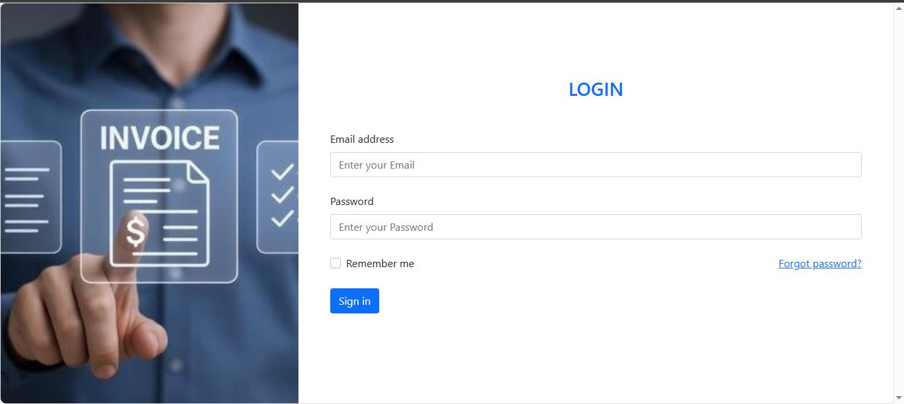
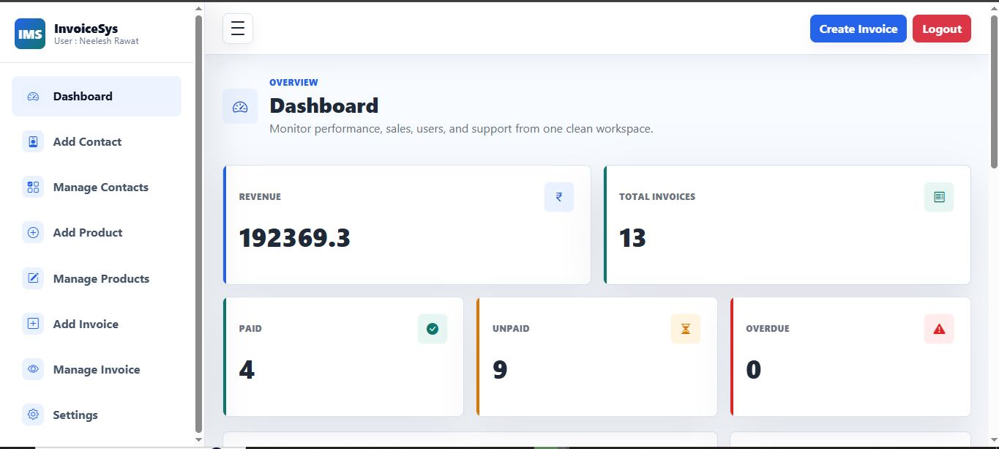
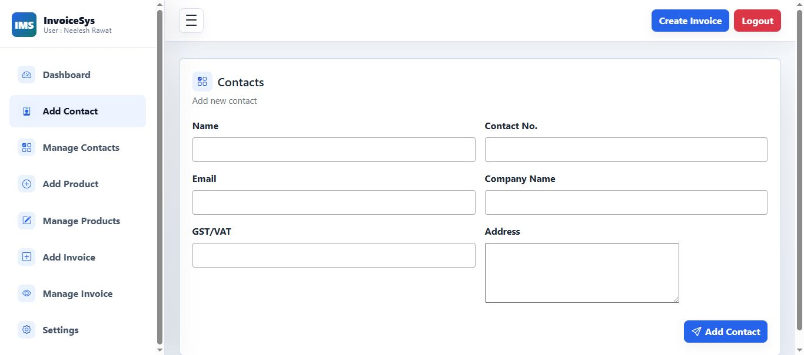
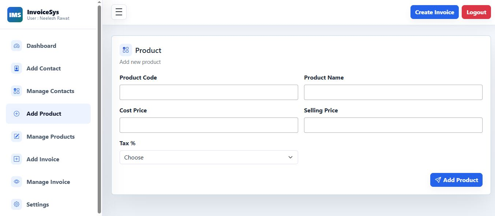
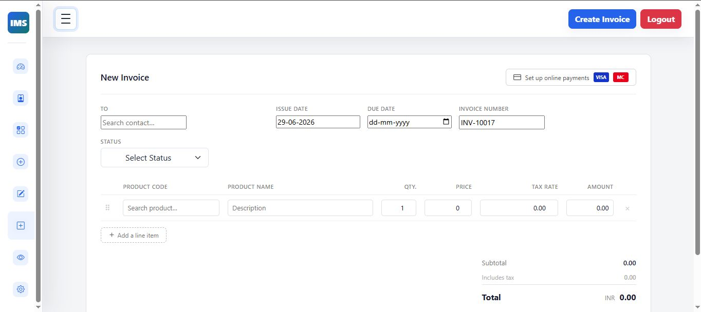

# Invoice Management System

<div align="center">


**A modern web-based Invoice Management System built with PHP and MySQL that streamlines customer, product, and invoice management with real-time analytics, PDF invoice generation, and RESTful APIs.**

</div>

---

## 📑 Table of Contents

* [Overview](#-overview)
* [Features](#-features)
* [Screenshots](#-screenshots)
* [Tech Stack](#-tech-stack)
* [Project Structure](#-project-structure)
* [Installation](#-installation)
* [Authentication & Security](#-authentication--security)
* [Dashboard](#-dashboard)
* [REST API](#-rest-api)
* [Database Schema](#-database-schema)
* [Future Enhancements](#-future-enhancements)
* [Contributing](#-contributing)
* [License](#-license)

---

# 📖 Overview

The **Invoice Management System** is a complete business management solution designed to simplify invoice creation and customer management.

The application enables administrators to manage customers, products, invoices, and financial records from a centralized dashboard while providing real-time insights into business performance.

Built with **PHP**, **MySQL**, **Bootstrap**, **jQuery**, and **AJAX**, the system offers a responsive interface, secure authentication, RESTful APIs, and professional PDF invoice generation.

---

# ✨ Features

## 👥 Customer Management

* Create, update, view and delete customers
* Store customer information
* Company & GST management
* Search and filter contacts

---

## 📦 Product Management

* Complete CRUD operations
* Product code management
* Cost & selling price tracking
* Tax management
* Dynamic product selection

---

## 🧾 Invoice Management

* Create invoices with multiple products
* Automatic tax calculations
* Grand total generation
* Edit invoices
* Delete invoices
* Payment status tracking
* Invoice history

---

## 📄 PDF Invoice Generation

Generate professional invoices containing:

* Company Information
* Customer Details
* Product Details
* Tax Breakdown
* Grand Total
* Printable PDF Format

Powered by **DomPDF**.

---

## 📊 Dashboard

Real-time dashboard statistics including:

* Total Revenue
* Total Invoices
* Paid Invoices
* Unpaid Invoices
* Overdue Invoices
* Latest Invoice Activity

Live updates are powered using **AJAX** without requiring page refreshes.

---

## 📂 Archive System

* Archive invoices
* Restore archived invoices
* Organize historical records

---

## 🔐 Authentication

* Secure Admin Login
* Remember Me
* Forgot Password
* Token-based Password Reset
* Session Management

---

## 🌐 REST API

REST-style endpoints for:

* Customers
* Products
* Invoices

Supports:

* GET
* POST
* PATCH
* DELETE

JSON responses with pagination and filtering.

---

# 📸 Screenshots


| Login                      | Dashboard                      |
| -------------------------- | ------------------------------ |
|  |  |

| Contacts                      | Products                      |
| ------------------------------ | ----------------------------- |
|  |  |

| Invoice                      | PDF Invoice              |
| ---------------------------- | ------------------------ |
|  |

---

# 🛠 Tech Stack

| Category   | Technologies             |
| ---------- | ------------------------ |
| Backend    | PHP                      |
| Database   | MySQL                    |
| Frontend   | HTML5, CSS3, Bootstrap 5 |
| JavaScript | jQuery, AJAX             |
| Charts     | Chart.js                 |
| PDF        | DomPDF                   |
| Server     | Apache (XAMPP/WAMP)      |

---


# 🚀 Installation

## 1. Clone Repository

```bash
git clone https://github.com/yourusername/invoice-management-system.git
```

## 2. Move Project

Move the project into your local server directory.

**XAMPP**

```text
htdocs/
```

**WAMP**

```text
www/
```

---

## 3. Create Database

Create a database named

```text
ims
```

Import

```text
database/ims.sql
```

---

## 4. Configure Database

Update

```php
config/connection.php
```

```php
$host = "localhost";
$user = "root";
$password = "";
$dbname = "ims";
```

---

## 5. Start Server

Start:

* Apache
* MySQL

Visit

```text
http://localhost/invoice-management-system/
```

---

# 🔒 Authentication & Security

The application includes several security mechanisms:

* Password Hashing
* Session Authentication
* Token-based Password Reset
* Prepared SQL Statements
* Input Validation
* Secure Login System
* Remember Me Support

---

# 📊 Dashboard

The dashboard provides real-time business insights including:

* Revenue Tracking
* Invoice Statistics
* Customer Count
* Product Count
* Payment Status
* Recent Invoice Activity

Powered by AJAX for seamless updates.

---

# 🌐 REST API

RESTful endpoints are available for:

| Module    | Methods               |
| --------- | --------------------- |
| Customers | GET POST PATCH DELETE |
| Products  | GET POST PATCH DELETE |
| Invoices  | GET POST PATCH DELETE |

Detailed API documentation is available in:

```text
docs/API.md
```

---

# 🗄 Database Schema

Main Tables

* users
* contacts
* products
* invoices
* invoice_items

---

# 🚀 Future Enhancements

* Email Invoice Support
* Payment Gateway Integration
* Inventory Management
* Multi-role Access Control
* Mobile Application
* Advanced Analytics
* Cloud Storage Integration

---

# 📄 License

This project is licensed under the **MIT License**.

---

# 👨‍💻 Author

**Neelesh Rawat**

GitHub: https://github.com/neeleshrawat510

---

<div align="center">


Made with ❤️ using **PHP**, **MySQL**, and **Bootstrap**.

</div>
